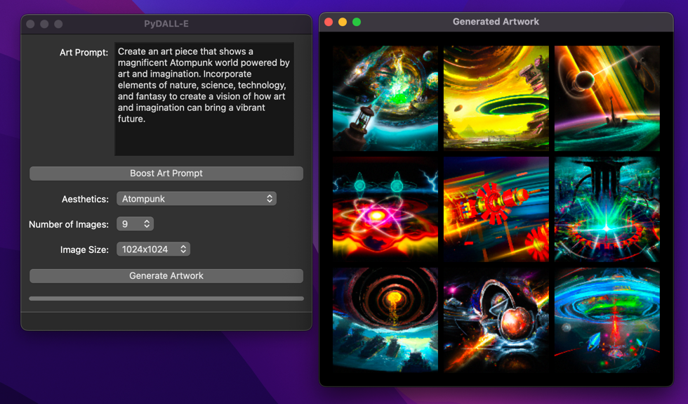

# PyDALL-E



PyDALL-E is a Python-based GUI application that allows users to generate images from textual descriptions using OpenAI's DALL-E API. The application is built with PyQt6, providing a user-friendly interface and leveraging multithreading for a responsive user experience.

## Features

- User-friendly interface with responsive design
- Generate images based on text descriptions
- AI prompt boosting for better image generation
- Aesthetic selector to refine generated art
- Customize the number of images and image size
- Asynchronous API requests for a smooth user experience
- Display generated images in a gallery layout
- Informative error handling
- Logging functionality for diagnostics

## Installation & Setup

An installer will be provided in a future update; until then:

1. Clone the repository: `git clone https://github.com/yourusername/PyDALL-E.git cd PyDALL-E`

2. Create a virtual environment and activate it:
   - On macOS and Linux:
     ```
     python3 -m venv venv
     source venv/bin/activate
     ```
   - On Windows:
     ```
     python -m venv venv
     venv\Scripts\activate
     ```

3. Install the required dependencies: `pip install -r requirements.txt`

4. Set your [OpenAI API Key](https://beta.openai.com/signup/):
   - On macOS and Linux:
     ```
     export OPENAI_API_KEY=your_api_key_here
     ```
   - On Windows (Command Prompt):
     ```
     set OPENAI_API_KEY=your_api_key_here
     ```
     or (PowerShell):
     ```
     $env:OPENAI_API_KEY="your_api_key_here"
     ```

## Usage

1. Run the application: `python main.py`
2. Enter a brief description in the text box.
3. Use the "Boost Art Prompt" button to augment, optionally selecting an aesthetic from the dropdown.
4. Configure the number of images (1-10) and the image size (256x256, 512x512, 1024x1024).
5. Click the "Generate Artwork" button to generate and display the images in a separate gallery.
6. The status and progress bars at the bottom update as the images are being generated.

## Known Issues

- GUI refinements and Image gallery are currently under development.
- Lack of an installer, planned for a future update.

## Future Features

- Upgraded art prompt design process to boost the quality of the generated art, such as more dropdowns to specify art parameters based on the DALL-E Prompt Book.
- GUI performance tuning
- GUI UI/UX enhancements
- AI Completion refinements
- More logging and better error handling
- Reset button

## Contributing

Contributions, bug reports, and feature requests are welcome! Feel free to submit pull requests or report issues to help improve the project.

## Acknowledgements

- [OpenAI](https://openai.com) for their coding assistance and models
- [The DALL·E 2 Prompt Book](https://dallery.gallery/the-dalle-2-prompt-book/) for inspiration and art prompt ideas
- [PyQt](https://www.riverbankcomputing.com/software/pyqt/) for the GUI framework
- [PyCharm](https://www.jetbrains.com/pycharm/) for the IDE
- [Aesthetics Wiki](https://aesthetics.fandom.com/wiki/List_of_Aesthetics) for the list of aesthetics

## License

This project is licensed under the MIT License.
